# Woliba Practical Task

This project does a User Registration.

---

## Screenshot

<p float="left">
    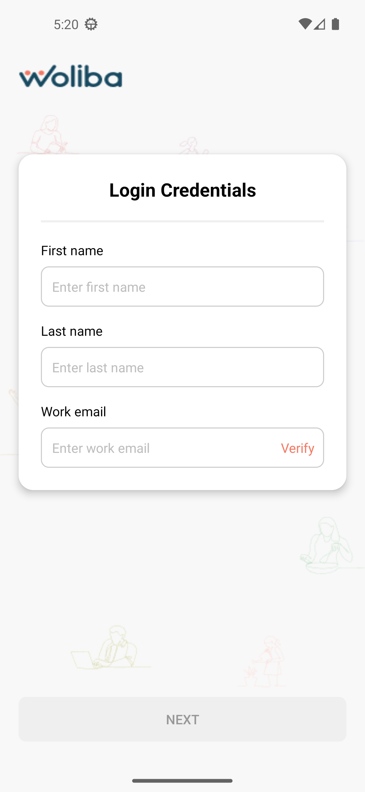
    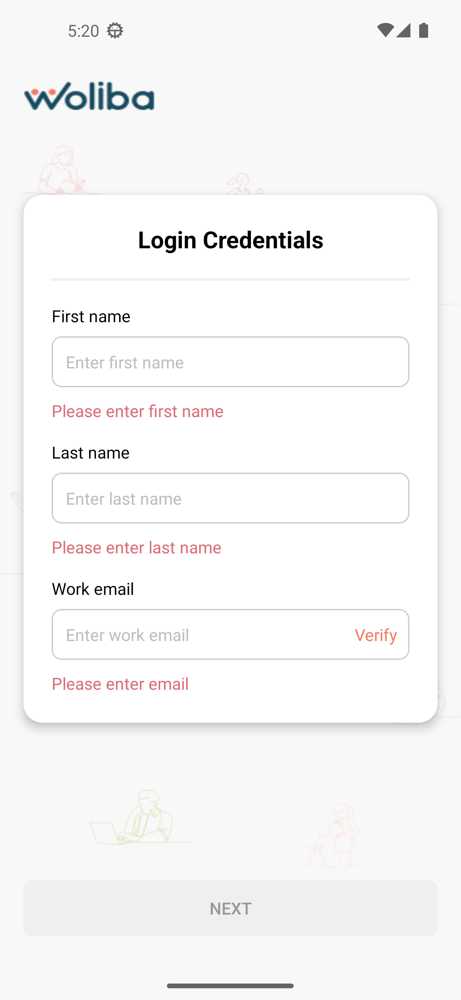
    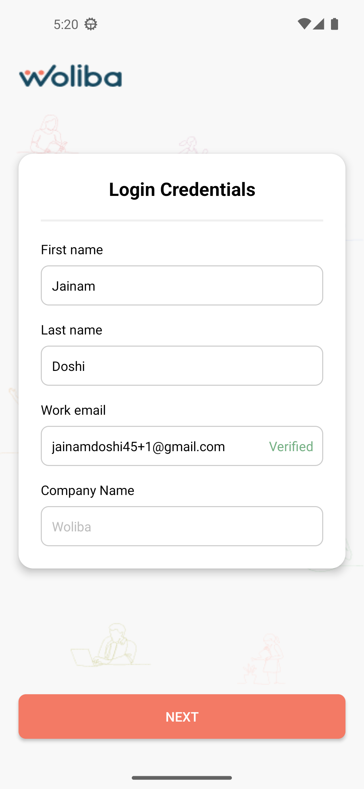
    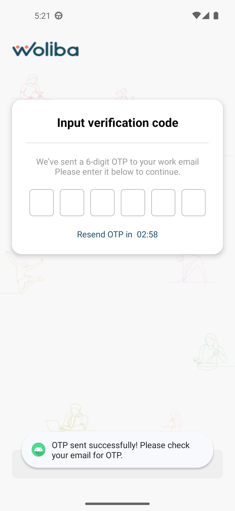
    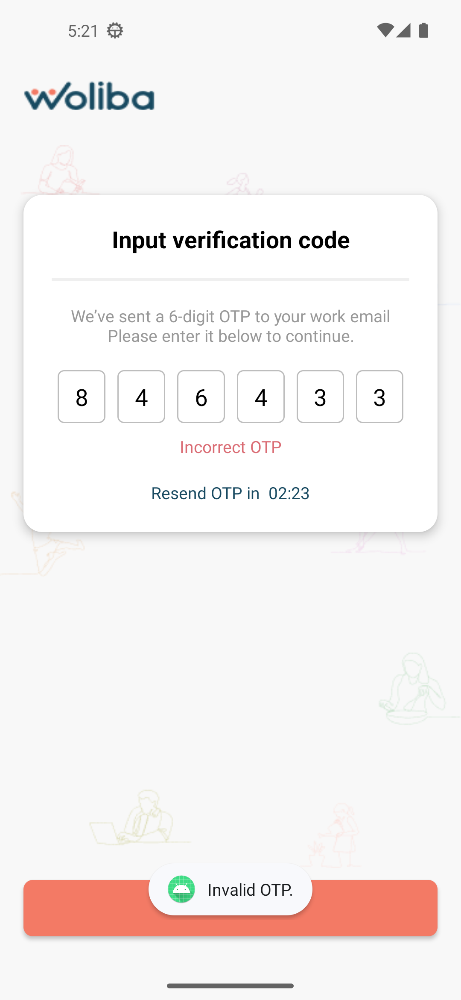
    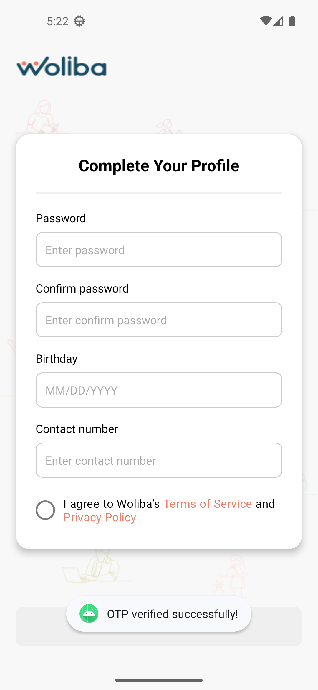
    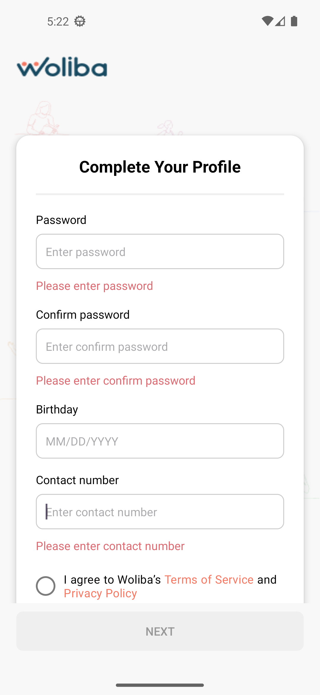
    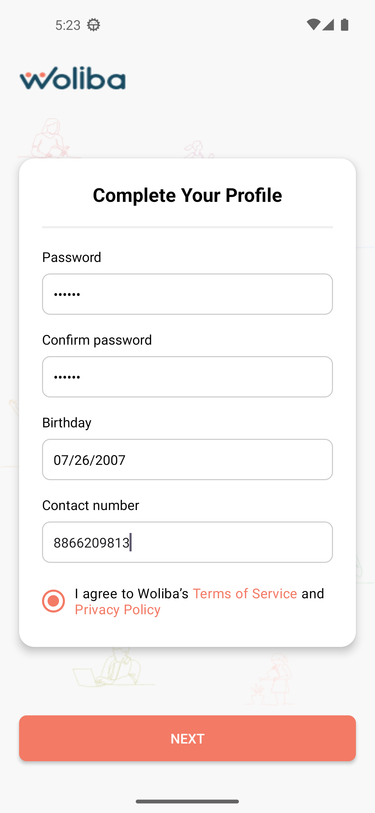
    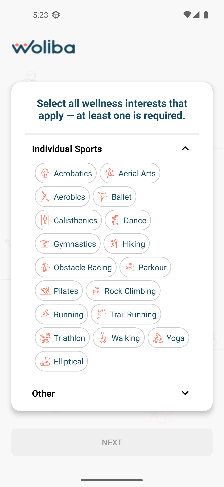
    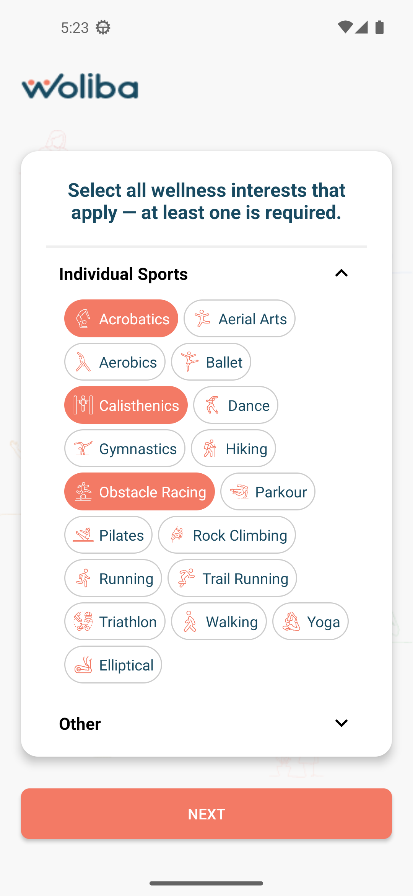
    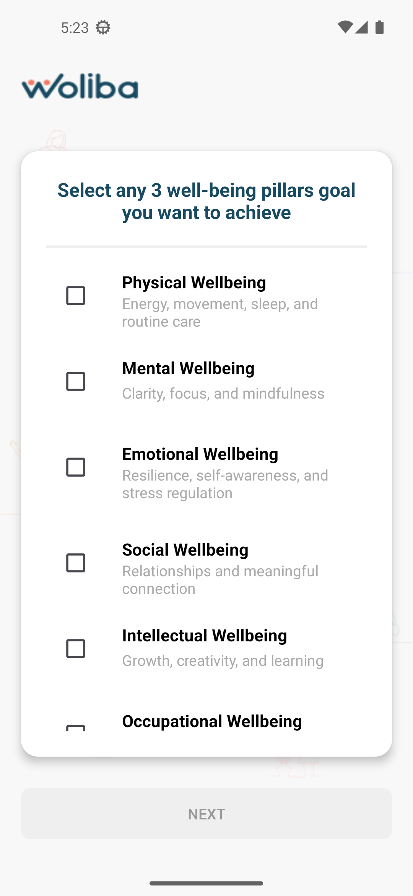
    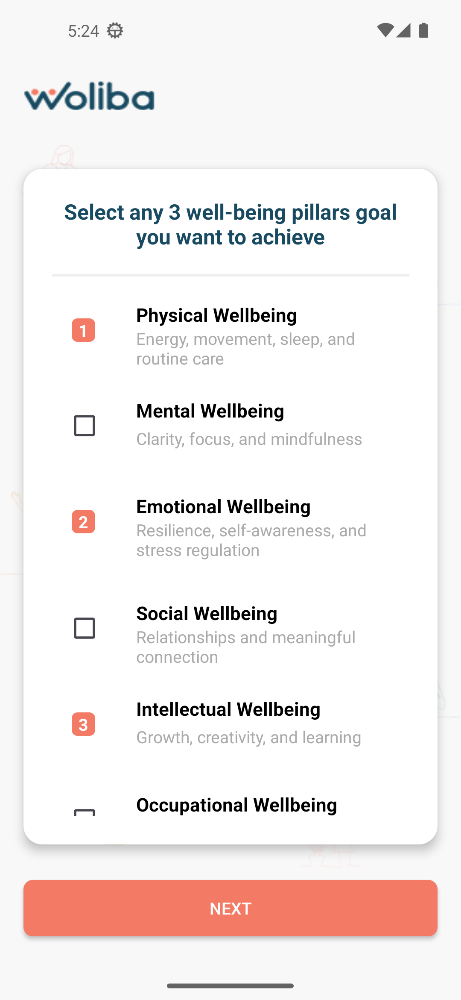
    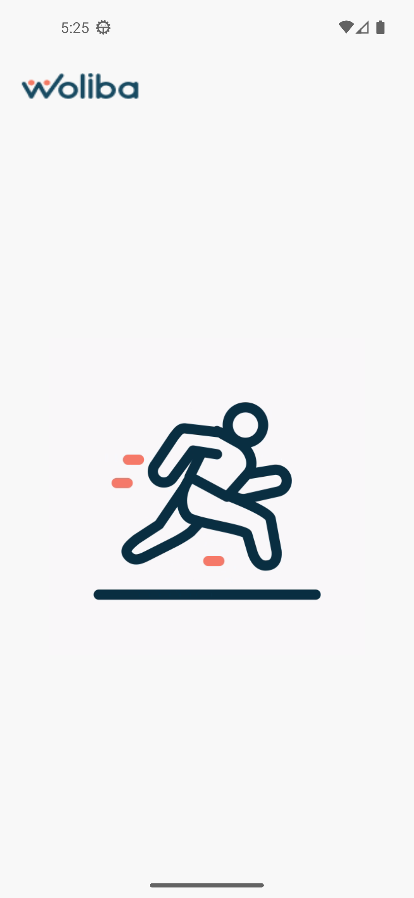
    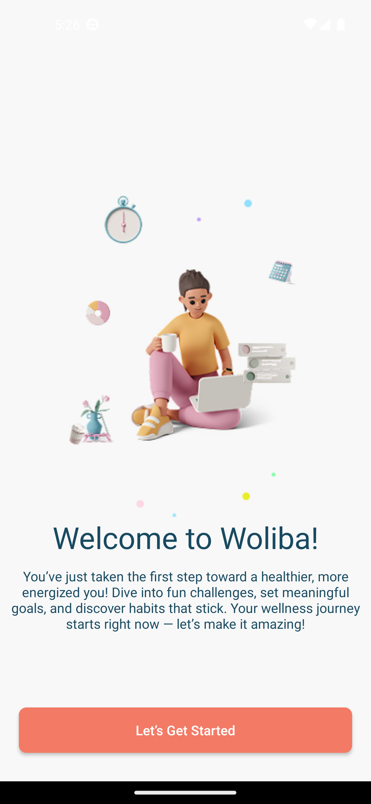
</p>

---

## Steps

- Step 1 — Register with Email & Password
- Step 2 — OTP Verification
- Step 3 — Complete Profile
- Step 4 — Interest Selection
- Step 5 — Wellbeing Pillars
- Step 6 — Registration Completion
- Step 7 — Welcome screen

---

## Tech Stack

- Language: Java
- Architecture: MVVM & Clean Architecture
- Jetpack Components: ViewModel, LiveData, Navigation
- Libraries:
  - Retrofit
  - OkHttp
  - Glide
  - Flexbox
 
---

## Setup Instructions

1. **Clone the repository**
   ```bash
   git clone https://github.com/jainam69/WolibaPracticalTask.git

---

